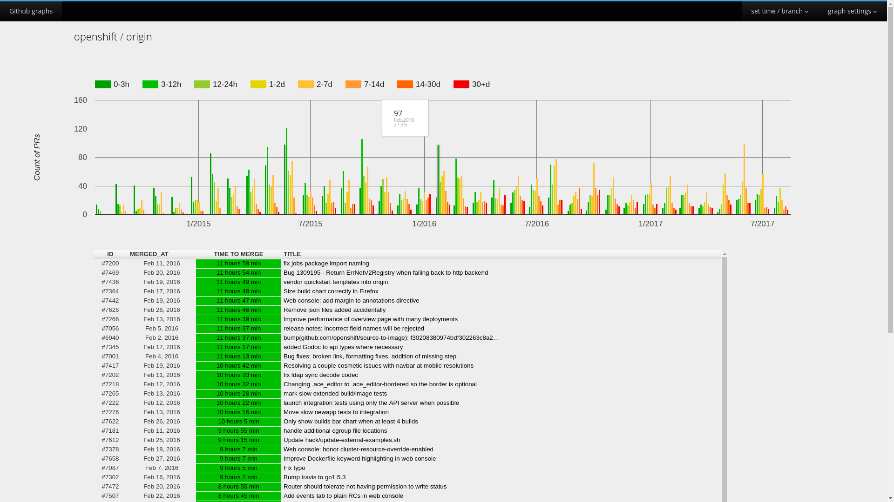

# GithubGraphs

Generate graphs and reports of pull requests for your GitHub repository. Plug in your repository URL, parse the PRs and see the health of your PR merge process.

## Installation

* Go to https://github.com/settings/tokens and create/select your token
* Check out [GithubGraphs](https://github.com/ocasek/GithubGraphs)
* `cd` to `GithubGraphs/Internship_project`
* Run:
  `pip install -r requirements.txt`

## How to run

### Starting the server
`TOKEN=<YOUR_TOKEN> python3 manage.py runserver --insecure`

### Updating the data

#### Updating all repositories
`TOKEN=<YOUR_TOKEN> python manage.py update`
#### Updating only one repository
`TOKEN=<YOUR_TOKEN> python manage.py update user/repo`
* You can also update repositories from "admin Websites".

#### Downloading data from repo
`TOKEN=<YOUR_TOKEN> python3 manage.py save_website --insecure`
* Also in "admin Add_websites" there is an action to save it.

If it doesn't work, check your Python version.
